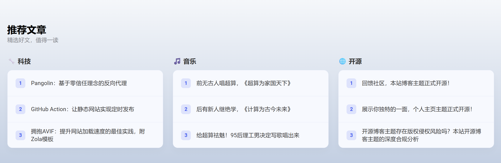

<div align="center">

<h1>Homepage Creators</h1>

<p align="center">

[Preview](#-preview) | [Quick Start](#-quick-start) | [Discussion](#-discussion)

[中文](https://github.com/iWangJiaxiang/Homepage-Creators/blob/main/README.md) | [English](https://github.com/iWangJiaxiang/Homepage-Creators/blob/main/README.en.md)

</p>
</div>

[](https://jiaxiang.wang)

## 🔥 Preview

| Site Name | Site Address |
|:------:|:-----------------------|
| Jiaxiang Wang Homepage | [https://www.jiaxiang.wang](https://www.jiaxiang.wang) |


## ℹ️ Introduction

[Homepage Creators](https://github.com/iWangJiaxiang/Homepage-Creators) is a personal homepage theme for [Zola](https://github.com/getzola/zola), styled similarly to Apple, beautiful and elegant.

> Note: This theme is a port of the open-source [HeoWeb](https://github.com/zhheo/HeoWeb) static theme, thanks to [Zhang Hong Heo](https://blog.zhheo.com/) for the generous sharing.

This theme is easy to use; you only need to modify the `config.toml` file to dynamically adjust content. No need to modify HTML content like the upstream repository, greatly reducing maintenance burden.

### 🔌 Features

> All features have been successfully ported

- [x] Basic
  - [x] Mobile responsiveness
  - [x] Animated scrolling
  - [x] AVIF / WebP adaptive
  - [x] Dynamic footer year update
  - [x] Analytics (Umami or custom)
  - [x] Multi-language support (i18n)
  - [x] Browser language detection prompt
- [x] Content Sections
  - [x] Navigation menu
  - [x] Hero section
  - [x] Author section
  - [x] Event section
  - [x] Product section (single)
  - [x] Product section (list)
- [x] Operations
  - [x] Sticky notifications
- [x] Compliance
  - [x] ICP filing (China)
  - [x] Public security filing (China)

## 📝 Quick Start

This section helps you quickly run your own homepage website. If you plan to formally use this theme, please refer to the [Formal Usage](#formal-usage) section for a better theme update experience.

### Free Static Page Hosting Services

#### GitHub Pages

1. [Fork](https://github.com/iWangJiaxiang/Homepage-Creators/fork) this repository.
1. Ensure the repository contains the `.github/workflows/deploy.yml` file, no additional configuration needed.
1. Enable the `Build GH Pages` workflow in the repository's **Actions** page, then manually trigger the build.
1. After committing changes, GitHub Actions will automatically build and deploy to the `gh-pages` branch.
1. In your GitHub repository, go to **Settings** -> **Pages**, select the `gh-pages` branch in the **Source** dropdown menu and save.
1. After deployment, you can access your site at `https://<your-username>.github.io/<repository-name>`.
1. Refer to the [Customize Your Homepage](#customize-your-homepage) section to customize your personal homepage.

#### CloudFlare Pages

1. [Fork](https://github.com/iWangJiaxiang/Homepage-Creators/fork) this repository.
1. Log in to [Cloudflare](https://dash.cloudflare.com/) and go to the **Pages** page.
1. Click the **Create a project** button.
1. Choose **Connect to Git**, then authorize Cloudflare to access your GitHub repository.
1. Select your `Homepage-Creators` repository from the list.
1. Configure build settings:
  - **Framework preset**: Select `None`.
  - **Build command**: Enter `zola build`.
  - **Build output directory**: Enter `public`.
  - Add environment variable `UNSTABLE_PRE_BUILD` with value `asdf plugin add zola https://github.com/salasrod/asdf-zola && asdf install zola $ZOLA_VERSION && asdf global zola $ZOLA_VERSION`
  - Add environment variable `ZOLA_VERSION` with value `0.20.0`
  - If you encounter any issues, please refer to the [official documentation](https://www.getzola.org/documentation/deployment/cloudflare-pages/)
1. Click the **Save and Deploy** button, Cloudflare Pages will start building and deploying your site.
1. After deployment, you can access your site via the Cloudflare-provided domain or bind a custom domain.
1. Refer to the [Customize Your Homepage](#customize-your-homepage) section to customize your personal homepage.

### Local Deployment

1. Refer to the [official documentation](https://www.getzola.org/documentation/getting-started/installation/) to install the Zola CLI tool
1. Clone this repository locally

    ```bash
    git clone --depth=1 https://github.com/iWangJiaxiang/Homepage-Creators
    ```

1. Navigate to the local repository

    ```bash
    cd Homepage-Creators
    ```

1. Run the preview command, then open the suggested URL in your browser

    ```bash
    zola serve
    ```

    You should now be able to access the homepage website

1. Refer to official docs to further customize your homepage
   - [Zola CLI documentation](https://www.getzola.org/documentation/getting-started/cli-usage/)
   - [Understanding project structure](https://www.getzola.org/documentation/getting-started/directory-structure/)
   - [Customization](https://www.getzola.org/documentation/getting-started/configuration/)

1. Refer to the [Customize Your Homepage](#customize-your-homepage) section to modify `config.toml` as needed; you should have a basic understanding of TOML format.

1. Place your image assets in the `static/img` folder as needed

## Formal Usage

The key difference from directly modifying this repository is content isolation. By installing this repository as a Zola theme, theme updates and your customizations are completely isolated, enabling long-term use without technical debt.

For formal usage, it's assumed you have basic knowledge of [Zola](https://github.com/getzola/zola) and Git Submodules. Steps:

1. Install the Zola CLI tool locally, refer to the [official docs](https://www.getzola.org/documentation/getting-started/installation/)
1. Initialize a new Zola website: `zola init <site name>`
1. Install this theme as a Git Submodule
   ```bash
   git submodule add -b main https://github.com/iWangJiaxiang/Homepage-Creators themes
   ```
   This creates a `themes/Homepage-Creators` folder
1. Download the repository contents
   ```bash
   git submodule update --init
   ```
   Now `themes/Homepage-Creators` should have content
2. Configure `config.toml`: set `theme = "Homepage-Creators"`
3. Refer to [Customize Your Homepage](#customize-your-homepage) to modify `config.toml` as needed

Your personal homepage website can then be maintained as a separate Git repository.

To update the theme, simply update the Git Submodule's branch/tag/code.

## Customize Your Homepage

Customization is very simple! No code changes needed — sections are fully modular. You only need to:

1. Place your image assets in the `static/img` folder (the hardest part is actually creating the images...)
2. Modify `config.toml` to configure sections, text content, and referenced images
3. Run `zola serve` for local preview with live reload

You need a basic understanding of Zola, such as [project structure](https://www.getzola.org/documentation/getting-started/directory-structure/) and [configuration](https://www.getzola.org/documentation/getting-started/configuration/) — these are straightforward and only require a single read-through.

> **V2 Update**: Content configuration now supports two methods:
> 1. **`config.toml`** (legacy): Place all sections in `config.toml` — **still fully compatible**
> 2. **`content/_index.md`** (recommended): Place sections and nav config in `content/_index.md` front-matter `[extra]`, with multi-language support

### Basic Configuration

Configure website information in `config.toml`:

```toml
[extra.site]
# Website establishment year, for copyright generation
start_year = 2024
# Website Logo
logo = "/img/logo.webp"
# Navigation bar Logo, defaults to website Logo if empty
nav_logo = "/img/logo.webp"
# Contact email
mail = "contact@example.com"
# ICP filing number (for Chinese websites)
compliance_icp = "ICP备XXXXXXXX号"
# Public security filing number (for Chinese websites)
compliance_security = "公网安备0000000000号"
# Public security filing link (for Chinese websites)
compliance_security_link = "https://www.beian.gov.cn/portal/registerSystemInfo?recordcode=0000000000"

[extra.other]
# Enable AVIF image format conversion
avif_enable = true
```

### Navigation Menu

Configure the **top navigation bar** and **notifications** in `config.toml`:

```toml
[extra.nav]

# Notification popup below navigation bar
[extra.nav.message]
enable = true
# support inline html
text = "🎉 Visit Author's Blog"
url = "https://blog.jiaxiang.wang"

# Center navigation bar
[extra.nav.center]
menus = [
    # internal = true: page scrolls to the section with matching id
    { name = "Home", url = "Home", internal = true},
    { name = "Theme", url = "Theme", internal = true},
    { name = "Blog", url = "Blog", internal = true},
    { name = "Media", url = "Media", internal = true},
    # internal = false: external link
    { name = "Projects", url = "https://blog.jiaxiang.wang/tags/project/", internal = false},
]

# Right navigation bar
[extra.nav.right]
menus = [
    { name = "Author's Blog", url = "https://blog.jiaxiang.wang", internal = false},
    { name = "Author's Github", url = "https://github.com/iWangJiaxiang", internal = false},
]
```

### Content Sections

You can flexibly customize sections. Except for the top nav, every section is a **modular component** with **unlimited order and quantity customization**.

Simply paste the **section config code at the end of `config.toml`**, after the `[extra.other]` section. The first line is always `[[extra.index.widgets]]` (`[[ ]]` represents an array in TOML syntax).

**Sections are displayed in the order they are defined** — rearrange the code to control display order.

If in doubt, refer to this project's [config.toml file](https://github.com/iWangJiaxiang/Homepage-Creators/blob/main/config.toml).

Currently supported modular components:

#### Modular Component: Header Content

Configuration code

```toml
[[extra.index.widgets]]
# Important, do not modify
type = "header"
[extra.index.widgets.value]
title_1 = "Main Title 1"
title_2 = "Main Title 2"
bio_1 = "Description with <span class=\"inline-word\">highlighted text</span>"
bio_2 = "Another description line"
# "Learn More" button link
about_url = "https://blog.jiaxiang.wang/about/"
# Right side image
cover = "/img/logo.svg"
# Small buttons next to "Learn More", usually for social media links
[[extra.index.widgets.value.links]]
class_icon = " icon-github-line"
url = "https://github.com/iWangJiaxiang"
[[extra.index.widgets.value.links]]
class_icon = " icon-github-line"
url = "https://github.com/iWangJiaxiang"
```

Screenshot (for visual reference only, may differ from config above)


#### Modular Component: Author Introduction

Configuration code

```toml
[[extra.index.widgets]]
# Important, do not modify
type = "author"
[extra.index.widgets.value]
# Name
name = "Site Owner"
# Avatar, place in /static/img folder, path starts with: /img/
avatar = "/img/logo01.webp"
title = "Team leader, architect,"
# Personal introduction
bio = "A brief introduction about the site owner~"
```

Screenshot (for visual reference only, may differ from config above)


#### Modular Component: Single Product

Showcase personal projects, works, achievements, etc.

Configuration code

```toml
[[extra.index.widgets]]
# Important, do not modify
type = "product-single"
[extra.index.widgets.value]
# Modify text content as needed
tip = "Homepage"
title = "Personal Homepage<br>Now Open Source"
bio_1 = "Stunning <span class=\"inline-word\">effects</span> like this page"
bio_2 = "Easy to configure, quickly build your <span class=\"inline-word\">homepage</span>"
# Product image, place in /static/img folder
img = "/img/homepage-single.avif"
# Product button list
[[extra.index.widgets.value.links]]
# Style: primary-button or second-link
class = "primary-button"
url = "https://github.com/iWangJiaxiang/Homepage-Creators"
name = "Get Source Code"
[[extra.index.widgets.value.links]]
class = "second-link"
url = "https://github.com/iWangJiaxiang"
name = "Developer's Page"
```

Screenshot (for visual reference only, may differ from config above)


#### Modular Component: Product List

Display a series of content

Configuration code

```toml
[[extra.index.widgets]]
# Important, do not modify
type = "product-list"
[extra.index.widgets.value]
# Modify text content as needed
title = "Media"
bio = "Contributing to the spirit of internet sharing"
[[extra.index.widgets.value.items]]
# Product logo, place in /static/img folder
logo = "/img/internet.svg"
title = "Personal Blog"
bio = "Introduction text for personal blog"
# Button config
url = "https://blog.jiaxiang.wang/"
button = "Visit"
# Show hot tag
hot = true
[[extra.index.widgets.value.items]]
logo = "/img/wechat.svg"
title = "WeChat Official Account"
bio = "Get updates first"
url = "https://blog.jiaxiang.wang/wechat"
button = "Visit"

```

Screenshot (for visual reference only, may differ from config above)


#### Modular Component: Featured Posts

Supports multi-column grouping to recommend great articles across different dimensions. The article list will **automatically scroll upwards continuously when there are more than 3 items**.

Configuration code

```toml
[[extra.index.widgets]]
# Important, do not modify
type = "featured-posts"
[extra.index.widgets.value]
# Left side title and description
title = "Featured Posts"
bio = "Curated reads worth your time"
# Background style setting, can be a CSS background property (e.g. gradient)
style = "background: linear-gradient(180deg, #f5f7fa 0%, #c3cfe2 100%);"
# Each group of articles occupies a separate column (up to 3 columns per row on desktop)
[[extra.index.widgets.value.columns]]
title = "🔧 Tech"
[[extra.index.widgets.value.columns.items]]
title = "Pangolin: A Reverse Proxy Based on Zero Trust"
url = "https://blog.jiaxiang.wang/articles/pangolin-a-reverse-proxy-for-zero-trust-network/"
[[extra.index.widgets.value.columns.items]]
title = "GitHub Action: Automatic Scheduled Releases for Static Sites"
url = "https://blog.jiaxiang.wang/articles/github-action-makes-static-site-publish-on-schedule/"
# Second column
[[extra.index.widgets.value.columns]]
title = "🎵 Music"
[[extra.index.widgets.value.columns.items]]
title = "Singing Supercomputing: 'A Supercomputer for the World'"
url = "https://blog.jiaxiang.wang/articles/sc-song/"
```

Screenshot (for visual reference only, may differ from config above)



#### Modular Component: Important Events

Display important activities, major events, etc.

Configuration code

```toml
[[extra.index.widgets]]
# Important, do not modify
type = "event"
[extra.index.widgets.value]
# Modify text content as needed
tip = "Major Event"
title = "Blog Theme<br>Now Open Source!"
bio = "A theme built for creators — start your blog journey at zero cost, zero maintenance!"
button = "Get Source Code"
note = "Built with Zola"
url = "https://github.com/iWangJiaxiang/zola-theme-jiaxiang.wang"
# Background image, place in /static/img folder
img = "/img/blog-event.avif"
```

Screenshot (for visual reference only, may differ from config above)


## 🌐 Multi-language

This theme supports multiple languages, with Chinese and English included by default.

### How It Works

Each language's content (sections, navigation, UI strings) is stored in the `[extra]` front-matter of the corresponding `content/_index.[lang].md` file:

```
content/
  _index.md        ← Chinese (default language)
  _index.en.md     ← English
```

`config.toml` only stores global settings (logo, filing numbers, etc.) and the language detection prompt dictionary.

### Adding a New Language

Example: adding Japanese

1. Register the language in `config.toml`:
   ```toml
   [languages.ja]
   title = "ホームページ"
   ```

2. Add a language detection prompt (`config.toml`):
   ```toml
   [extra.i18n_detect.ja]
   message = "このページは日本語でもご覧いただけます"
   action = "切替"
   url = "/ja/"
   ```

3. Create `content/_index.ja.md`, copy the structure from `_index.en.md` and translate the content

### Backward Compatibility

If you still configure sections in `config.toml` (legacy method), the default language page will prioritize `config.toml` content, ensuring no changes are needed after upgrading the theme.

## 💬 Discussion

If you have any suggestions or comments about the theme, feel free to submit PRs & Issues.

## 🔐 License

[Homepage Creators](https://github.com/iWangJiaxiang/Homepage-Creators) is open-source under the [AGPL](./LICENSE) license, please comply with the open-source agreement.

## 📝 Acknowledgments

CDN acceleration and security protection for this project are sponsored by [Tencent EdgeOne](https://edgeone.ai/?from=github).

[](https://edgeone.ai/?from=github)
